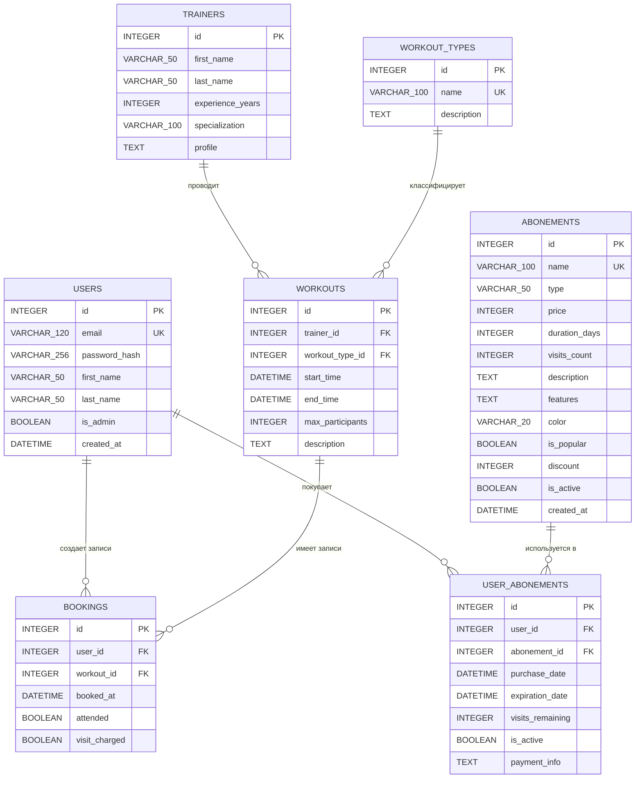

# ER-диаграмма проекта Fitness Gym App

## Связи

- `users.id` -> `bookings.user_id`: один пользователь может иметь много записей на тренировки.
- `workouts.id` -> `bookings.workout_id`: одна тренировка может иметь много записей.
- `trainers.id` -> `workouts.trainer_id`: один тренер проводит много тренировок.
- `workout_types.id` -> `workouts.workout_type_id`: один тип тренировки используется во многих тренировках.
- `users.id` -> `user_abonements.user_id`: один пользователь может купить много абонементов.
- `abonements.id` -> `user_abonements.abonement_id`: один тариф абонемента может быть куплен многими пользователями.
