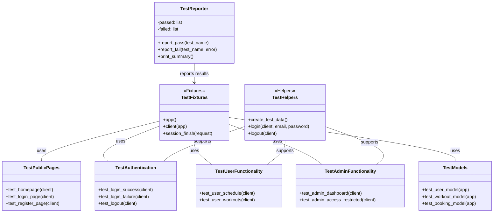

# Tests Class Diagram

```mermaid
classDiagram
    class TestReporter {
        -passed: list
        -failed: list
        +report_pass(test_name)
        +report_fail(test_name, error)
        +print_summary()
    }
    
    class TestFixtures {
        <<Fixtures>>
        +app()
        +client(app)
        +session_finish(request)
    }
    
    class TestHelpers {
        <<Helpers>>
        +create_test_data()
        +login(client, email, password)
        +logout(client)
    }
    
    class TestPublicPages {
        +test_homepage(client)
        +test_login_page(client)
        +test_register_page(client)
    }
    
    class TestAuthentication {
        +test_login_success(client)
        +test_login_failure(client)
        +test_logout(client)
    }
    
    class TestUserFunctionality {
        +test_user_schedule(client)
        +test_user_workouts(client)
    }
    
    class TestAdminFunctionality {
        +test_admin_dashboard(client)
        +test_admin_access_restricted(client)
    }
    
    class TestModels {
        +test_user_model(app)
        +test_workout_model(app)
        +test_booking_model(app)
    }
    
    TestFixtures -- TestPublicPages : uses
    TestFixtures -- TestAuthentication : uses
    TestFixtures -- TestUserFunctionality : uses
    TestFixtures -- TestAdminFunctionality : uses
    TestFixtures -- TestModels : uses
    TestHelpers -- TestAuthentication : supports
    TestHelpers -- TestUserFunctionality : supports
    TestHelpers -- TestAdminFunctionality : supports
    TestReporter --> TestFixtures : reports results
``` 