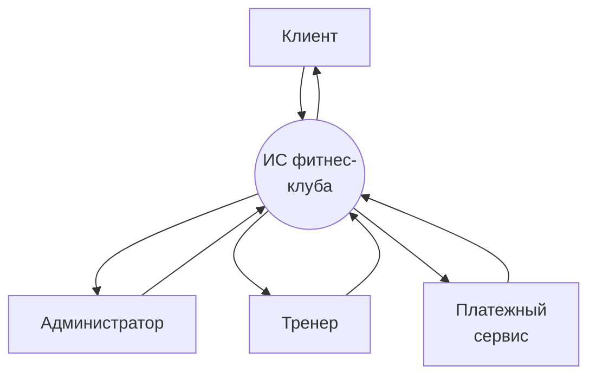
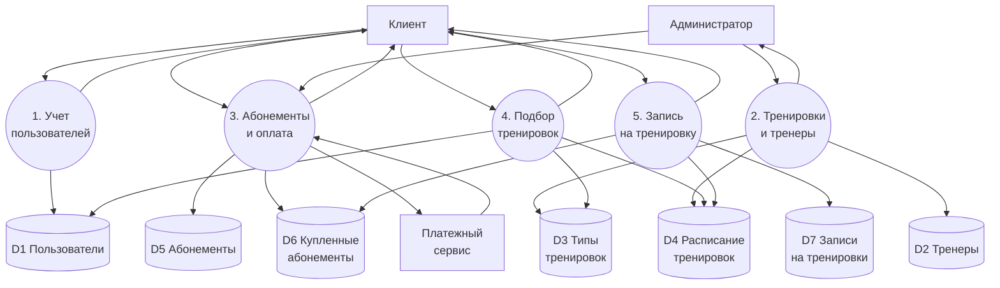
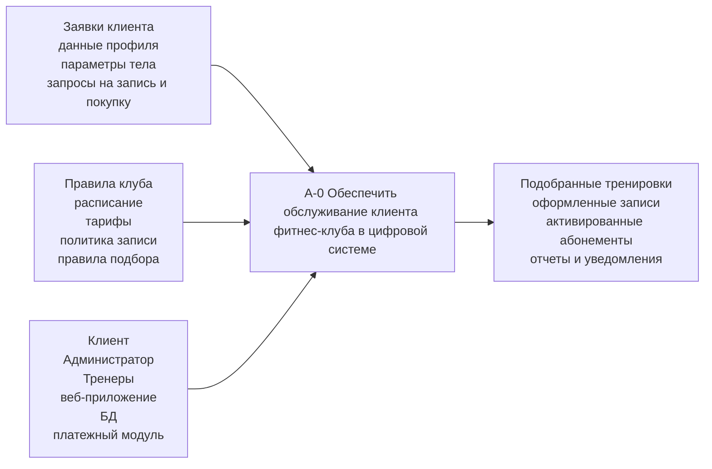
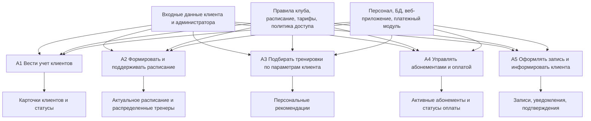
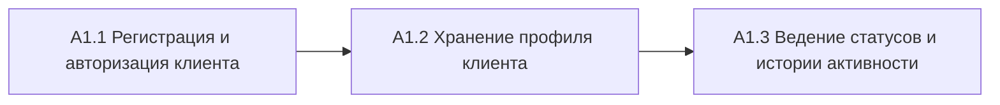
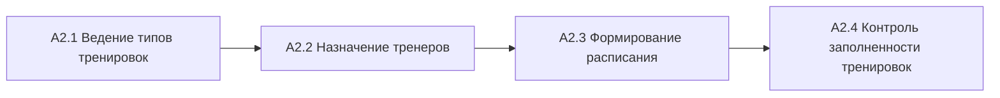
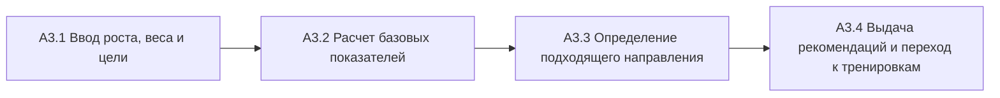
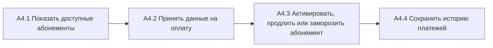
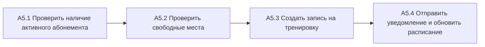

# DFD и IDEF0 для ИС фитнес-клуба

Ниже приведен пример моделей для темы проекта: **информационная система фитнес-клуба**.  
Структура выполнена по логике методических указаний из файла `24_metod_PIS_09.03.03_2024.docx`, с адаптацией под текущий проект.

## 1. Границы моделируемой системы

Рассматриваемая система автоматизирует:

- регистрацию и авторизацию клиентов;
- просмотр тренировок и тренеров;
- подбор тренировок по параметрам клиента;
- запись на тренировки;
- покупку, продление и заморозку абонементов;
- ведение клиентской информации;
- управление расписанием и тренерами со стороны администратора.

---

## 2. DFD

## 2.1. Контекстная DFD-диаграмма

Потоки данных для контекстной DFD:

1. `Клиент -> ИС фитнес-клуба`: регистрация, вход, параметры, запись, покупка абонемента.
2. `Администратор -> ИС фитнес-клуба`: управление клиентами, тренерами, тренировками, абонементами.
3. `Тренер -> ИС фитнес-клуба`: данные о специализации и занятиях.
4. `Платежный сервис -> ИС фитнес-клуба`: статус оплаты.
5. `ИС фитнес-клуба -> Клиент`: расписание, рекомендации, подтверждения, статус абонемента.
6. `ИС фитнес-клуба -> Администратор`: отчеты, списки, аналитика.
7. `ИС фитнес-клуба -> Тренер`: назначенные занятия.
8. `ИС фитнес-клуба -> Платежный сервис`: запрос на оплату.

## 2.2. DFD уровня 1

Основные потоки DFD уровня 1:

1. `Клиент -> P1`: данные регистрации и входа.
2. `P1 -> D1`: сохранение профиля пользователя.
3. `P1 -> Клиент`: возврат статуса входа и профиля.
4. `Администратор -> P2`: создание и редактирование тренеров и тренировок.
5. `P2 -> D2, D3, D4`: запись данных о тренерах, типах тренировок и расписании.
6. `P2 -> Администратор`: актуальное расписание.
7. `Клиент, Администратор -> P3`: покупка абонемента и управление тарифами.
8. `P3 -> D5, D6`: обновление каталога и купленных абонементов.
9. `P3 <-> Платежный сервис`: передача платежа и получение статуса.
10. `P3 -> Клиент`: статус покупки, продления или заморозки.
11. `Клиент -> P4`: рост, вес и цель тренировок.
12. `P4 -> D1, D3, D4`: использование данных пользователя, типов тренировок и расписания.
13. `P4 -> Клиент`: персональные рекомендации.
14. `Клиент -> P5`: выбор тренировки.
15. `P5 -> D4, D6, D7`: проверка расписания, абонемента и создание записи.
16. `P5 -> Клиент`: подтверждение записи.

## 2.3. Хранилища данных и потоки

| Хранилище | Содержание |
|---|---|
| `D1 Пользователи` | Данные клиента, статус, цель тренировок, параметры профиля |
| `D2 Тренеры` | Карточки тренеров, специализация, опыт |
| `D3 Типы тренировок` | Каталог направлений: кардио, силовые, йога, стретчинг и др. |
| `D4 Расписание тренировок` | Слоты занятий, время, привязка к тренеру |
| `D5 Абонементы` | Тарифы фитнес-клуба |
| `D6 Купленные абонементы` | Активные и архивные покупки пользователей |
| `D7 Записи на тренировки` | Факты бронирования занятий |

Основные потоки данных:

- клиент передает системе данные для регистрации, записи и подбора тренировок;
- администратор передает системе данные по расписанию, тренерам и тарифам;
- система обращается к хранилищам данных и возвращает пользователям результаты обработки;
- платежный сервис получает платежные данные и возвращает статус операции.

---

## 3. IDEF0

## 3.1. Контекстная диаграмма IDEF0 (A-0)

Функция верхнего уровня:  
**Обеспечить обслуживание клиента фитнес-клуба в цифровой системе**

## 3.2. Диаграмма декомпозиции IDEF0 (A0)

---

## 4. Декомпозиция IDEF0 по функциям

## 4.1. Декомпозиция A1 "Вести учет клиентов"

Результат:

- создается учетная запись клиента;
- сохраняются контактные данные и цель тренировок;
- обновляются статусы клиента и история активности.

## 4.2. Декомпозиция A2 "Формировать и поддерживать расписание"

Результат:

- поддерживается каталог направлений;
- тренировки распределяются между тренерами;
- формируются доступные слоты для записи;
- контролируется количество свободных мест.

## 4.3. Декомпозиция A3 "Подбирать тренировки по параметрам клиента"

Результат:

- система получает параметры клиента;
- рассчитывает ориентировочный ИМТ;
- подбирает направление: снижение веса, набор мышц, выносливость, гибкость;
- предлагает подходящие тренировки.

## 4.4. Декомпозиция A4 "Управлять абонементами и оплатой"

Результат:

- клиент выбирает тариф;
- система проводит оплату;
- активируется или изменяется статус абонемента;
- история платежей сохраняется в системе.

## 4.5. Декомпозиция A5 "Оформлять запись и информировать клиента"

Результат:

- проверяются ограничения на запись;
- создается бронь на тренировку;
- клиент получает подтверждение и видит занятие в своем расписании.

---

## 5. Краткий вывод для отчета

Для проекта фитнес-клуба могут быть использованы:

- `DFD` для отображения потоков данных между клиентом, администратором, тренером, платежным сервисом и хранилищами данных;
- `IDEF0` для отображения функций системы, управляющих воздействий, механизмов и результатов работы.

В данной модели верхнеуровневая функция системы декомпозирована на пять ключевых процессов:

1. учет клиентов;
2. управление расписанием и тренерами;
3. интеллектуальный подбор тренировок;
4. управление абонементами и оплатой;
5. запись на тренировки и уведомления.

Такая структура хорошо подходит под текущий дипломный проект, потому что совпадает с уже реализованной функциональностью приложения.
